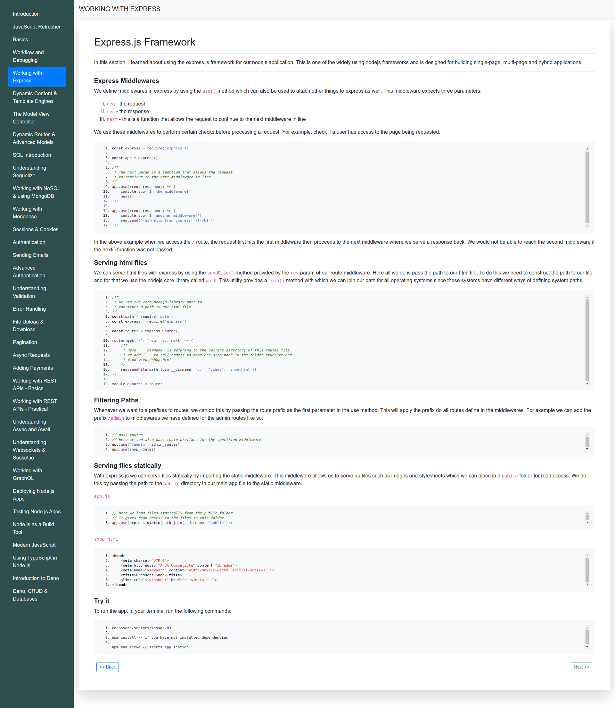

## About

### Brief

This repo demonstrates the lessons I went through while learning nodejs. The purpose of learning this is to create awesome and fast backend APIs for my front-end SPAs. 

### Setup

Simply:
- Clone the repo 

```
git clone https://github.com/PeterKitonga/nodejslearning.git
```
- Navigate to the project and click on the `index.html` file of a lesson

### Illustration


### Tutorial
Visit [Udemy](https://www.udemy.com/course/nodejs-the-complete-guide) for the tutorial